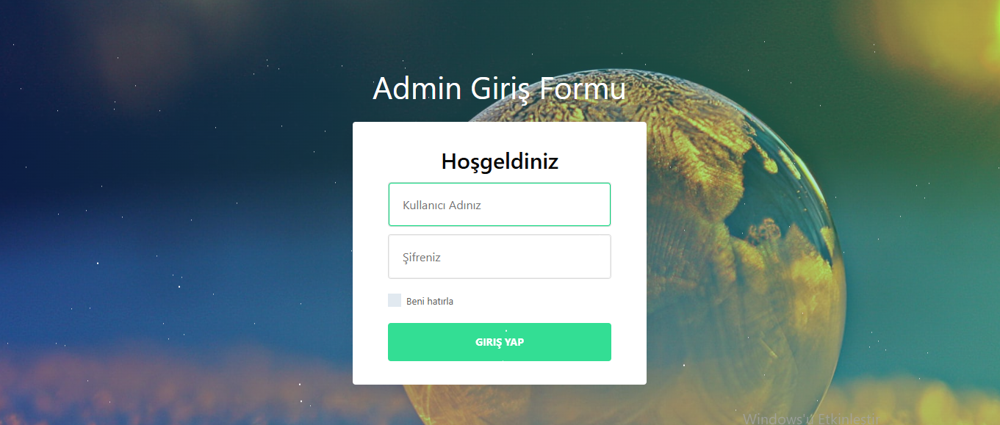
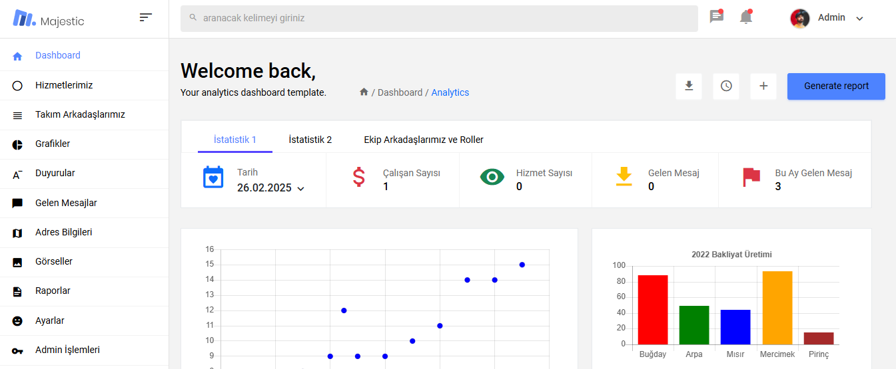
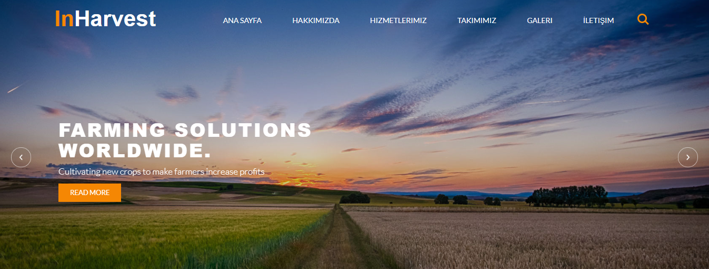
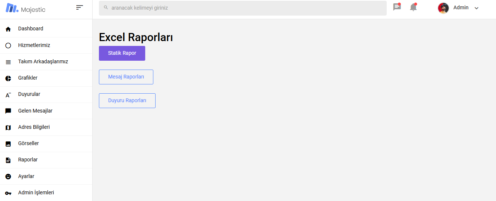

- This project aims to demonstrate how a Web Application works with C#, ASP.NET Core MVC, and MSSQL Server.

- The project is a web application that includes a homepage and an admin panel where the users can manipulate data.

- It is for demonstration purposes only and is developed based on what is taught in a course by Murat Yücedað.

## Technologies used in this project:
  - C#
  - N-Layer Architecture 
  - ASP.NET Core MVC
  - ASP.NET Core Identity
  - ASP.NET Core Fluent Validation
  - Entity Framework Core
  - MSSQL Server
  - Razor Pages
  - View Components
  - Model Binding
  - HTML
  - CSS
  - JavaScript

## Some views from the project:

